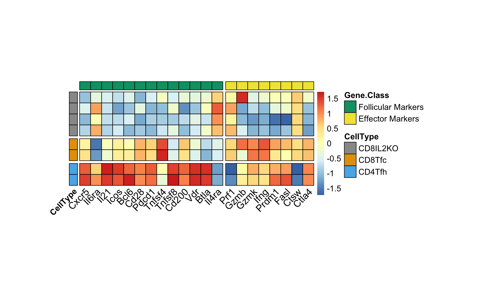
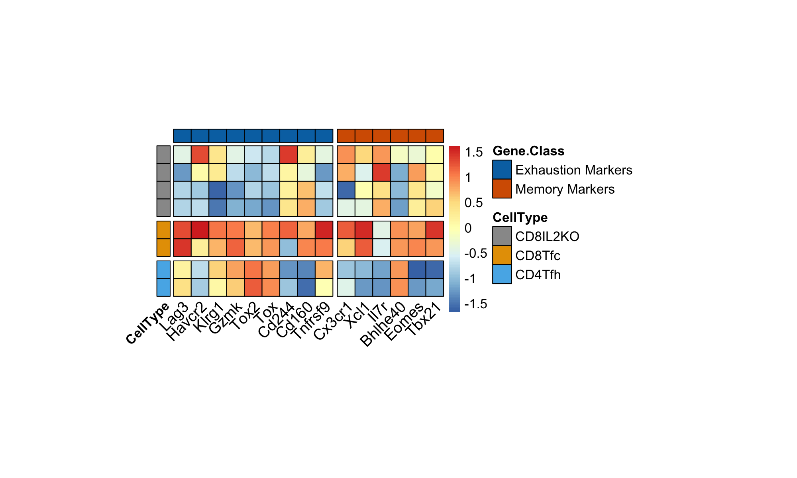

# CD8_Follicular_Analysis
Scripts for reproducing the RNA-seq analysis performed in the study: [CD8 follicular T cells localize throughout the follicle during germinal center reactions and maintain cytolytic and helper properties](https://doi.org/10.1016/j.jaut.2021.102690).

You can find a free version of the article on PubMed.

PMID: 34274825


 


## Data

Reference genome: GRCm38.p6
- [RefSeq GCF_000001635.26](https://www.ncbi.nlm.nih.gov/data-hub/genome/GCF_000001635.26/)


GEO accession: [GSE177911](https://www.ncbi.nlm.nih.gov/geo/query/acc.cgi?acc=GSE177911)
- CD8 Follicular Analysis
  - IL-2-KO CD4 Tfh & IL-2-KO CD8 Tfc

GEO accession: [GSE112540](https://www.ncbi.nlm.nih.gov/geo/query/acc.cgi?acc=GSE112540)
- Previously published IL-2-KO CD8 T cells


## Alignment

    ## Building and index for the reference genome
    # load the subread package
    library(Rsubread)
    ref <-("~/data/GCF_000001635.26_GRCm38.p6/GCF_000001635.26_GRCm38.p6_genomic.fna")
    buildindex(basename="mus_reference_GRCm38_index",reference=ref)
    
    ## Alignment
    align(index="~/data/GCF_000001635.26_GRCm38.p6/index/mus_reference_GRCm38_index",
	readfile1="~/data/follicular_fastqs/CD4_Tfh_1_R1.fastq",
	readfile2="~/data/follicular_fastqs/CD4_Tfh_1_R2.fastq", 
	nBestLocations=10, 
	output_file="~/data/follicular_fastqs/CD4_Tfh_1_alPEv3.BAM",
	nthreads=16,
	phredOffset=33)

    align(index="~/data/GCF_000001635.26_GRCm38.p6/index/mus_reference_GRCm38_index",
      readfile1="~/data/follicular_fastqs/CD4_Tfh_2_R1.fastq",
      readfile2="~/data/follicular_fastqs/CD4_Tfh_2_R2.fastq", 
      nBestLocations=10, 
      output_file="~/data/follicular_fastqs/CD4_Tfh_2_alPEv3.BAM",
      nthreads=16,
      phredOffset=33)

    align(index="~/data/GCF_000001635.26_GRCm38.p6/index/mus_reference_GRCm38_index",
      readfile1="~/data/follicular_fastqs/CD8_Tfc_1_R1.fastq",
      readfile2="~/data/follicular_fastqs/CD8_Tfc_1_R2.fastq", 
      nBestLocations=10, 
      output_file="~/data/follicular_fastqs/CD8_Tfc_1_alPEv3.BAM",
      nthreads=16,
      phredOffset=33)

    align(index="~/data/GCF_000001635.26_GRCm38.p6/index/mus_reference_GRCm38_index",
      readfile1="~/data/follicular_fastqs/CD8_Tfc_2_R1.fastq",
      readfile2="~/data/follicular_fastqs/CD8_Tfc_2_R2.fastq", 
      nBestLocations=10, 
      output_file="~/data/follicular_fastqs/CD8_Tfc_2_alPEv3.BAM",
      nthreads=16,
      phredOffset=33)


## Requirements

CLI Tools:

- [fastqc](https://www.bioinformatics.babraham.ac.uk/projects/fastqc/)

- [trimmomatic](https://doi.org/10.1093/bioinformatics/btu170)

R Packages:

- [featureCounts](https://doi.org/10.1093/bioinformatics/btt656)

- [Rsubread](https://bioconductor.org/packages/release/bioc/html/Rsubread.html)

- [limma](https://bioconductor.org/packages/release/bioc/html/limma.html)

- [edgeR](https://bioconductor.org/packages/release/bioc/html/edgeR.html)

- [clusterProfiler](https://bioconductor.org/packages/release/bioc/html/clusterProfiler.html)

- [tidyverse](https://www.tidyverse.org)

- [extrafont](https://cran.r-project.org/web/packages/extrafont/index.html)

- [gplots](https://cran.r-project.org/web/packages/gplots/index.html)

- [AnnotationDbi](https://bioconductor.org/packages/release/bioc/html/AnnotationDbi.html)

- [org.Mm.eg.db](https://bioconductor.org/packages/release/data/annotation/html/org.Mm.eg.db.html)


## Citation

Please cite if our repository was useful for your research:
````
@article{VALENTINE2021102690,
  author = {Kristen M. Valentine and Genevieve N. Mullins and Oscar A. Davalos and Lek Wei Seow and Katrina K. Hoyer},
  title = {CD8 follicular T cells localize throughout the follicle during germinal center reactions and maintain cytolytic and helper properties},
  journal = {Journal of Autoimmunity},
  volume = {123},
  pages = {102690},
  year = {2021},
  issn = {0896-8411},
  doi = {https://doi.org/10.1016/j.jaut.2021.102690},
  url = {https://www.sciencedirect.com/science/article/pii/S0896841121000986},
  keywords = {CD8 T follicular Cells, CXCR5+ CD8 T cell, Autoimmunity, Germinal center, T regulatory cell},
}
````
